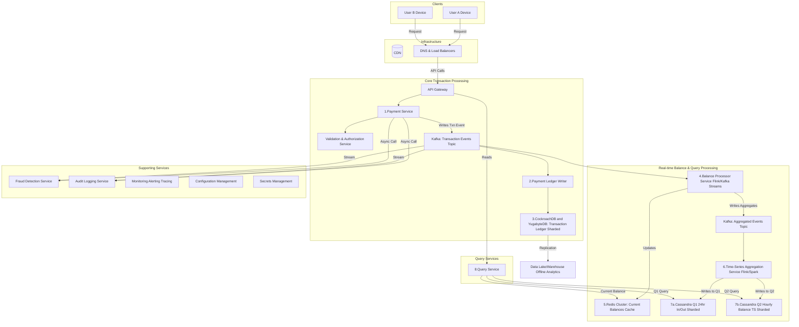

```
Design a highly scalable, real-time system for a **staff-level system design interview**. Focus on the core architectural components, data flow, and critical trade-offs for supporting immense concurrent user interactions and maintaining low latency under peak global load, typical of a high-volume, interactive platform.
```
# Wallet Service

```
Design a payment system that supports in-game currency transfers between accounts. Then needed to support two types of queries:

1. For each account, return the total incoming and outgoing amounts in the past 24 hours
2. For each account, return an hourly balance time series over the past 30 days

```
### Solution
#### Data Model
- Transfers
	- transfer_id: Index
	- request_id: Index
	- sender_account_id
	- receiver_account_id
	- created_at: Index
	- status: INITIATED | COMPLETED | FAILED
- Transactions
	- base_id
	- parent_transaction_id
	- transaction_id
	- user_id
	- account_id
	- amount(+ / - for direction)
	- reversal/fee/transfer/etc
	- created_at
- Account24HRSummary
	- account_id
	- aggregation_hour
	- incoming_amount_24h
	- outgoing_amount_24h
	- last_updated_at
- AccountHourlyBalance
	- account_id
	- snapshot_hour
	- balance
	- last_updated_at
	- 
```
1001,2001,2001,3001,4001,99,DR,100000000
1001,2002,2002,3002,4002,99,CR,100000001
```

# Gemini Answer
This design addresses the challenge of building a highly scalable, real-time in-game currency transfer system for Roblox, focusing on immense concurrency, low latency, and specific query requirements.

## 1. System Goals & Constraints

*   **High Scalability:** Support billions of transactions and millions of concurrent users globally.
*   **Low Latency:** Real-time transfers (sub-100ms) and query responses (sub-500ms for common queries).
*   **High Availability & Durability:** Minimal downtime, no data loss. Financial-grade reliability.
*   **Strong Consistency (Core Ledger):** Transactions must be atomic, consistent, isolated, and durable (ACID).
*   **Eventual Consistency (Derived Data):** Cached balances and analytical views can tolerate slight delays.
*   **Security:** Prevent fraud, double-spending, and unauthorized access.
*   **Auditability:** All transactions must be fully traceable.
*   **Query Support:**
    *   Q1: For each account, total incoming/outgoing amounts in the past 24 hours.
    *   Q2: For each account, hourly balance time series over the past 30 days.

## 2. Core Architectural Principles

*   **Microservices:** Decoupled, independently deployable services.
*   **Event-Driven Architecture:** Asynchronous communication via message queues/streams for scalability and resilience.
*   **Sharding:** Distribute data across multiple nodes/clusters to handle scale.
*   **Immutability/Event Sourcing:** The core ledger is an append-only log of events, simplifying consistency and auditability.
*   **CQRS (Command Query Responsibility Segregation):** Separate models for updates (commands) and reads (queries) to optimize each.
*   **Idempotency:** Ensure operations can be retried safely without unintended side effects.
*   **Multi-Region Deployment:** For global reach, disaster recovery, and reduced latency.

## 3. High-Level Architecture Diagram



## 4. Core Components & Data Flow

### 4.1. Core Transaction Processing

1.  **API Gateway (e.g., Nginx, Envoy):**
    *   **Role:** Entry point for all client requests. Handles SSL termination, rate limiting, authentication (via integration with AuthN/AuthZ service), and basic request validation.
    *   **Scalability:** Horizontally scalable via load balancers.
    *   **Idempotency:** Enforces unique `request_id` per client operation to prevent duplicate processing on retries.

2.  **Payment Service (Microservice):**
    *   **Role:** Orchestrates the currency transfer.
        *   Receives `transfer` requests (sender, receiver, amount, currency, `request_id`).
        *   Validates input (amount > 0, valid currency, etc.).
        *   Authorizes sender (sufficient funds, account status, etc.) - calls `Validation & Authorization Service`.
        *   **Crucial Logic:**
            *   Performs a double-entry debit-credit operation. This is done by constructing a **single atomic transaction event** that includes both the debit and credit legs.
            *   Publishes this transaction event to the `Transaction Events` Kafka topic. This is the **write-ahead log** for the system.
            *   **Idempotency Check:** Before processing, checks if `request_id` has already been processed using a dedicated `Idempotency Store` (e.g., Redis or a dedicated table in CockroachDB). If already processed, returns the previous result.
            *   For real-time balance check during authorization, queries `Redis Cluster: Current Balances Cache`.
    *   **Scalability:** Stateless, allowing for easy horizontal scaling.
    *   **Consistency:** Relies on Kafka's ordering and transactional producers for atomicity of event publication, and downstream ledger writer for eventual durability.

3.  **Kafka: Transaction Events Topic:**
    *   **Role:** High-throughput, fault-tolerant, ordered, immutable log of all currency transfers. Acts as the system's central nervous system and source of truth for all downstream processing.
    *   **Scalability:** Sharded by `accountId` (or a hash of `accountId`) for partitioning, ensuring events for a single account are processed in order by a single consumer.
    *   **Technologies:** Apache Kafka or Apache Pulsar.

4.  **Payment Ledger Writer (Service):**
    *   **Role:** Consumes messages from `Kafka: Transaction Events Topic` and persists them to the `Transaction Ledger`.
    *   **Critical:** Ensures exactly-once processing semantic for writing to the ledger by tracking committed offsets or using idempotency keys from the Kafka messages.
    *   **Error Handling:** Retries on transient errors, dead-letter queue for persistent failures.

5.  **CockroachDB / YugabyteDB: Transaction Ledger (Sharded):**
    *   **Role:** The authoritative, immutable, ACID-compliant ledger for all financial transactions.
    *   **Why Distributed SQL (NewSQL)?**
        *   **Global Distribution & Geo-Sharding:** Native support for distributing data across regions and sharding by primary key (e.g., `account_id` prefix) for low-latency writes to local replicas.
        *   **Strong Consistency (ACID):** Guarantees atomicity for multi-row transactions (e.g., recording both debit and credit entries for a single transfer) even across nodes. This simplifies the double-entry bookkeeping.
        *   **Scalability:** Horizontally scalable while maintaining ACID properties.
        *   **High Availability:** Automatic replication and failover.
    *   **Schema (simplified):**

    ```sql
CREATE TABLE transactions (
	transaction_id UUID PRIMARY KEY DEFAULT gen_random_uuid(),
	request_id UUID NOT NULL, -- For idempotency tracking
	sender_account_id BIGINT NOT NULL,
	receiver_account_id BIGINT NOT NULL,
	amount DECIMAL(18, 4) NOT NULL,
	currency VARCHAR(10) NOT NULL,
	timestamp TIMESTAMPTZ NOT NULL DEFAULT now(),
	status VARCHAR(20) NOT NULL, -- 'COMPLETED', 'FAILED', 'PENDING'
	type VARCHAR(20) NOT NULL, -- 'TRANSFER_IN', 'TRANSFER_OUT' (for easier querying of in/out)
	-- Add index on (sender_account_id, timestamp) and (receiver_account_id, timestamp)
	INDEX idx_sender_ts (sender_account_id, timestamp DESC),
	INDEX idx_receiver_ts (receiver_account_id, timestamp DESC),
	UNIQUE (request_id) -- Ensures idempotency
);

-- For tracking current balance (can be eventually consistent and derived)
-- In a real distributed SQL DB, this could be kept in the same logical DB
-- but might have different sharding/access patterns.
-- More likely this is a *derived* value from an event stream.
-- For simplicity, let's assume it's in a separate, eventually consistent store.
```


* *Sharding Strategy:** Shard by `account_id` (or a consistent hash of it) to collocate all transactions and derived balances for a given account on the same shard/region where possible.

### 4.2. Real-time Balance & Query Processing (CQRS Pattern)

These components consume from Kafka to build optimized read models.

6.  **Balance Processor Service (e.g., Apache Flink, Kafka Streams):**
    *   **Role:** Consumes from `Kafka: Transaction Events Topic`.
        *   Maintains an in-memory state of current account balances (or uses RocksDB for larger state).
        *   For each transaction event: updates the sender's and receiver's balance.
        *   Publishes balance updates to `Redis Cluster: Current Balances Cache`.
    *   **Consistency:** Provides *eventual consistency* for current balances. The delay is minimal (milliseconds).
    *   **Scalability:** Horizontally scalable by adding more Flink/Kafka Streams instances. State is managed per partition.

7.  **Redis Cluster: Current Balances Cache:**
    *   **Role:** Extremely low-latency key-value store for current account balances.
    *   **Data Model:** `account_id -> current_balance`.
    *   **Scalability:** Sharded Redis Cluster.
    *   **Consistency:** Eventual consistency. The source of truth remains the `Transaction Ledger`.

8.  **Time-Series Aggregation Service (e.g., Apache Flink, Spark Streaming):**
    *   **Role:** Consumes from `Kafka: Transaction Events Topic` (or a dedicated `Aggregated Events Topic` if pre-processing happens).
    *   **For Q1 (24-hour In/Out):**
        *   Maintains a 24-hour tumbling window for each account.
        *   Aggregates incoming and outgoing amounts within that window.
        *   Outputs the aggregates to `Cassandra: Q1 (24hr In/Out)`.
    *   **For Q2 (Hourly Balance Time Series):**
        *   For each account, at the end of every hour, calculates the *balance at that hour* (by applying all transactions up to that point). This can be done by simply storing the end-of-hour balance and using a snapshotting approach.
        *   Outputs these hourly snapshots to `Cassandra: Q2 (Hourly Balance TS)`.
    *   **Scalability:** State management for windows/snapshots is distributed across stream processing tasks.

9.  **Cassandra Cluster (or ScyllaDB):**
    *   **Role:** Highly scalable, distributed NoSQL database optimized for high write throughput and time-series data.
    *   **Why Cassandra?** Excellent for wide-column, time-series data, and scales linearly. Tolerates eventual consistency, which is acceptable for analytical queries.
    *   **Schema for Q1 (24hr In/Out - simplified):**
        ```sql
        CREATE TABLE account_daily_summary (
            account_id BIGINT,
            date DATE,
            incoming_amount DECIMAL(18, 4),
            outgoing_amount DECIMAL(18, 4),
            last_updated TIMESTAMP,
            PRIMARY KEY ((account_id), date)
        ) WITH CLUSTERING ORDER BY (date DESC);
        ```
        *   *Query:* `SELECT incoming_amount, outgoing_amount FROM account_daily_summary WHERE account_id = ? AND date >= ? AND date <= ?;` (The streaming service aggregates this and updates daily. For 24 hours specifically, it would be a rolling sum).
    *   **Schema for Q2 (Hourly Balance TS - simplified):**
        ```sql
        CREATE TABLE account_hourly_balance_series (
            account_id BIGINT,
            hour_timestamp TIMESTAMP, -- e.g., '2023-10-27 10:00:00Z'
            balance DECIMAL(18, 4),
            PRIMARY KEY ((account_id), hour_timestamp)
        ) WITH CLUSTERING ORDER BY (hour_timestamp DESC);
        ```
        *   *Query:* `SELECT hour_timestamp, balance FROM account_hourly_balance_series WHERE account_id = ? AND hour_timestamp >= ? AND hour_timestamp <= ?;`
    *   **Sharding Strategy:** Shard by `account_id` as the partition key. This ensures all historical data for an account is co-located, optimizing read queries for a single account.

### 4.3. Query Service

10. **Query Service (Microservice):**
    *   **Role:** Dedicated service for handling all read requests.
    *   **Current Balance:** Fetches directly from `Redis Cluster: Current Balances Cache`.
    *   **Q1 Query (24hr In/Out):** Queries `Cassandra: Q1 (24hr In/Out)`. Calculates the sum over the last 24 hours (potentially spanning two daily records if queried mid-day).
    *   **Q2 Query (Hourly Balance TS):** Queries `Cassandra: Q2 (Hourly Balance TS)` for the last 30 days.
    *   **Scalability:** Horizontally scalable. Can implement its own caching layers for hot data.

### 4.4. Supporting Services

*   **Validation & Authorization Service:** Handles user authentication, permission checks, and potentially checks for account flags (frozen, suspended).
*   **Fraud Detection Service:**
    *   **Role:** Asynchronously consumes from `Kafka: Transaction Events Topic`.
    *   Applies ML models/rule engines to detect suspicious patterns (e.g., rapid transfers, unusual amounts, transfers to high-risk accounts).
    *   Can trigger alerts, flag accounts, or even issue compensating transactions.
*   **Audit Logging Service:** Consumes `Kafka: Transaction Events Topic` to write immutable audit logs to a data lake/warehouse (e.g., S3, HDFS) for compliance and historical analysis.
*   **Observability (Monitoring, Alerting, Tracing):** Prometheus/Grafana for metrics, ELK Stack for logs, Jaeger/OpenTelemetry for distributed tracing. Critical for understanding system health and debugging.

## 5. Data Models (Refined)

### 5.1. CockroachDB (Transaction Ledger)

```sql
CREATE TABLE transactions (
    transaction_id UUID PRIMARY KEY DEFAULT gen_random_uuid(),
    request_id UUID NOT NULL,               -- Client-generated unique ID for idempotency
    source_account_id BIGINT NOT NULL,
    destination_account_id BIGINT NOT NULL,
    amount DECIMAL(18, 4) NOT NULL,
    currency VARCHAR(10) NOT NULL,          -- e.g., 'Robux'
    transaction_type VARCHAR(20) NOT NULL,  -- 'TRANSFER', 'PURCHASE', 'SALE', etc.
    status VARCHAR(20) NOT NULL,            -- 'COMPLETED', 'FAILED', 'PENDING'
    timestamp TIMESTAMPTZ NOT NULL DEFAULT now(),
    metadata JSONB,                         -- Additional details like game ID, item ID etc.
    UNIQUE (request_id)                     -- Ensures idempotency for retries
);

-- Indexes for efficient querying by account and time
CREATE INDEX idx_source_account_id_ts ON transactions (source_account_id, timestamp DESC);
CREATE INDEX idx_destination_account_id_ts ON transactions (destination_account_id, timestamp DESC);
```
*Note: For double-entry bookkeeping, a single 'TRANSFER' transaction logically creates two ledger entries - one debit for sender, one credit for receiver. The `transactions` table above represents the *transfer event*. The underlying ledger system would decompose this into two `account_entry` records internally or conceptually.*

### 5.2. Cassandra (Aggregations)

**Q1: 24-hour Incoming/Outgoing**

```sql
CREATE TABLE account_24hr_summary (
    account_id BIGINT,
    aggregation_hour TIMESTAMP, -- Hourly snapshot of rolling 24hr sum
    incoming_amount_24hr DECIMAL(18, 4),
    outgoing_amount_24hr DECIMAL(18, 4),
    last_updated TIMESTAMP,
    PRIMARY KEY ((account_id), aggregation_hour)
) WITH CLUSTERING ORDER BY (aggregation_hour DESC);
```
*   The `Time-Series Aggregation Service` continuously updates these rolling sums. When a query comes, it fetches the latest `aggregation_hour` entry for the account.

**Q2: Hourly Balance Time Series (30 days)**

```sql
CREATE TABLE account_hourly_balance_snapshots (
    account_id BIGINT,
    snapshot_hour TIMESTAMP, -- e.g., '2023-10-27 10:00:00Z'
    balance DECIMAL(18, 4),
    PRIMARY KEY ((account_id), snapshot_hour)
) WITH CLUSTERING ORDER BY (snapshot_hour DESC);
```
*   The `Time-Series Aggregation Service` calculates and inserts a new row for each account at the end of every hour.

## 6. Scalability & Resilience Considerations

*   **Sharding:**
    *   **Core Ledger (CockroachDB):** Shard by `account_id` to ensure all transactions related to an account are co-located or handled by a specific shard, minimizing cross-shard transactions for balance updates.
    *   **Kafka:** Partition topics by `account_id` to ensure ordered processing of events per account.
    *   **Redis/Cassandra:** Shard by `account_id` for efficient lookups and distribution of data.
*   **Asynchronous Processing:** Event-driven architecture with Kafka decouples services, allowing them to scale independently and absorb peak loads.
*   **Stateless Services:** `Payment Service`, `Query Service` are stateless, allowing them to be scaled up/down easily with load balancers.
*   **Data Replication:** All databases (CockroachDB, Redis, Cassandra) are deployed in clusters with replication for high availability and fault tolerance. Multi-region deployments are essential for global platforms like Roblox.
*   **Idempotency:** Crucial for retries in a distributed system. The `request_id` passed from the client, stored in the `transactions` table, prevents duplicate processing.
*   **Circuit Breakers & Timeouts:** Implement these patterns between services to prevent cascading failures.
*   **Backpressure:** Kafka naturally provides backpressure. Stream processing frameworks like Flink handle backpressure for stateful computations.
*   **Leader-Follower (Master-Replica):** For databases where applicable (CockroachDB handles this internally), read replicas can offload read traffic.
*   **Disaster Recovery:** Geo-replicated data and services across multiple regions. Regular backups.

## 7. Critical Trade-offs

*   **Consistency vs. Latency:**
    *   **Core Ledger:** Strong consistency (ACID) is non-negotiable for the financial integrity of the system. We choose CockroachDB for this.
    *   **Derived Data (Balances, Aggregations):** Eventual consistency is accepted for cached balances and analytical views. This allows for significantly higher throughput and lower read latency for these views, as they don't require synchronous updates with the ledger. The delay is typically in the order of milliseconds to seconds, which is acceptable for user-facing balances and historical queries.
*   **Operational Complexity vs. Scalability:**
    *   This design involves many distributed components (Kafka, Flink, CockroachDB, Cassandra), which increases operational complexity (monitoring, deployment, troubleshooting).
    *   **Trade-off:** This complexity is justified by the extreme scale and low-latency requirements of Roblox. A simpler monolithic design would quickly hit bottlenecks.
*   **Storage Cost vs. Read Performance:**
    *   Storing hourly balance snapshots for 30 days means accumulating a lot of data.
    *   **Trade-off:** This pre-aggregation significantly improves query performance for the hourly time series, avoiding expensive on-the-fly calculations over raw transactions. Data retention policies can prune older snapshots.
*   **Read-Your-Own-Writes Consistency:**
    *   A user might perform a transfer and immediately query their balance. Due to eventual consistency of the Redis cache, they might see an old balance for a very brief moment.
    *   **Mitigation:** For critical user-facing balance displays, the Payment Service could synchronously update the Redis cache *after* successfully publishing to Kafka (or even after ledger write), or the UI could display a "processing" state until confirmation, or fetch the balance directly from the ledger for the specific account for critical views. However, for Roblox scale, the slight eventual consistency is often accepted.

## 8. Security Considerations

*   **Authentication & Authorization:** Robust identity system, token-based authentication (JWTs), granular role-based access control (RBAC).
*   **Encryption:** Data in transit (TLS/SSL) and at rest (disk encryption, KMS for keys).
*   **Fraud Detection:** Real-time stream processing of transactions for anomaly detection.
*   **Rate Limiting:** Protect against abuse and DoS attacks at the API Gateway.
*   **Input Validation:** Strict validation on all incoming request parameters.
*   **Least Privilege:** Services only have permissions necessary for their function.
*   **Audit Trails:** Comprehensive logging of all system activities and transactions for forensic analysis.
*   **Secret Management:** Securely manage API keys, database credentials using services like Vault or AWS Secrets Manager.

## 9. Future Enhancements

*   **Payment Reconciliation:** Automated processes to reconcile transactions between internal ledgers and external payment providers (if fiat currency were involved).
*   **Chargeback Handling:** Processes for handling chargebacks and reversals.
*   **Advanced Analytics:** Integration with data warehousing solutions (Snowflake, BigQuery) for complex business intelligence and reporting over long historical data.
*   **User Notifications:** Real-time notifications for successful/failed transfers.
*   **Multi-Currency Support:** Extend the system to handle different in-game currencies or real-world currencies (with exchange rates).
*   **Smart Contracts/Scripting:** For more complex in-game economic mechanics.

This robust design provides a highly scalable, real-time foundation for Roblox's in-game currency transfers, addressing the unique challenges of a massive, interactive platform.