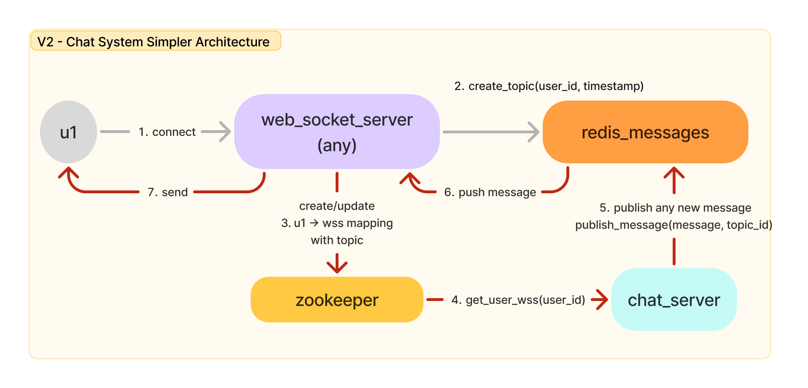
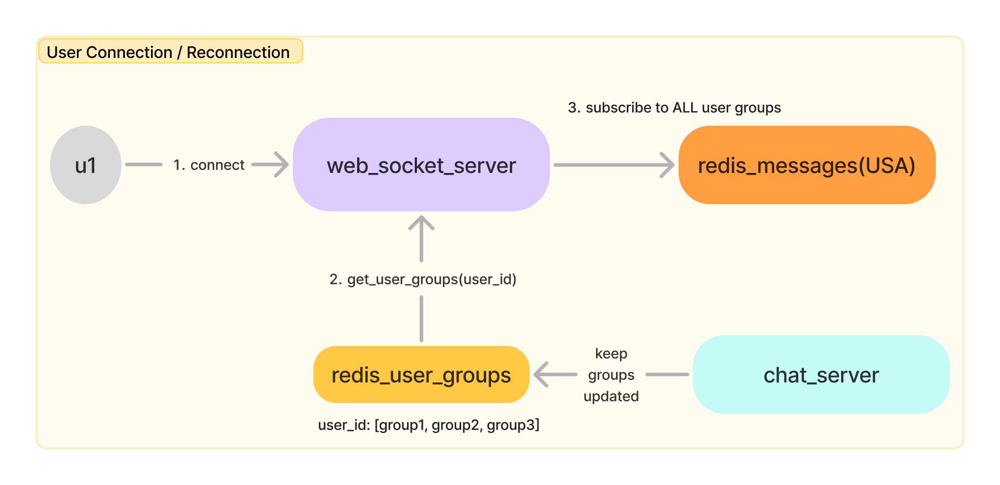
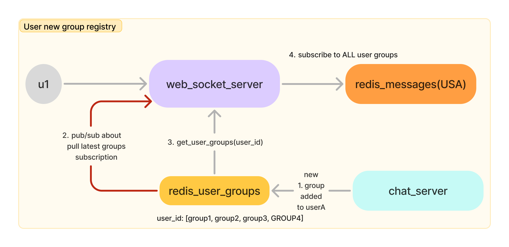
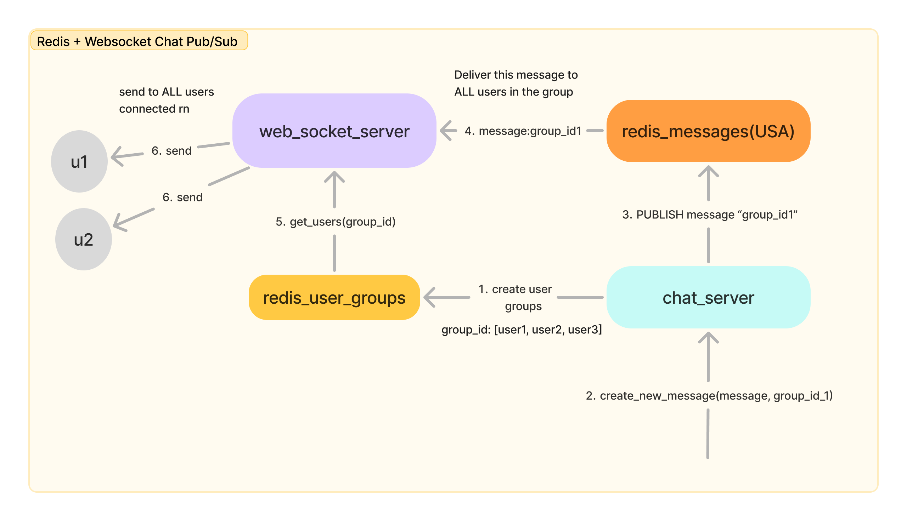
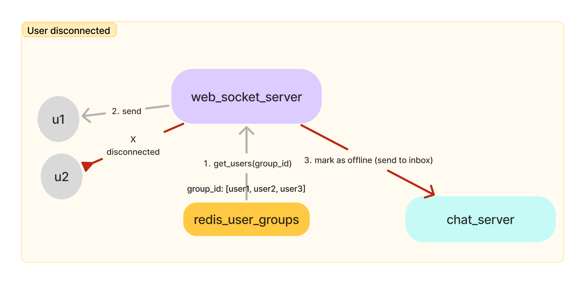

#### Main Points
- **push** based ➙ subscriber **pushes** message to redis, redis pushes **message** to subscribers
- if subscriber is down or disconnected, those messages are lost
	- hence at most once delivery
- in a chat system, this subscriber can be a websocket_server
	- partition_key in this case is generally "group_id" ➙ essentially batching messages

###### Solution 1 (Simple) Example chat system

1. The main thing to notice in comparision to below solution is
	1. chat_server (CS) publishes to Redis per user where as in other solution, the message is published per group_id and WSS decides to forward it
	2. This solution is much simpler to implement, but puts more load on CS and Redis publish
		1. The other solution puts more load on WSS
2. Details
	1. User connects to ANY WSS (after disconnect also works)
	2. WSS creates a topic for this user, and subscribes to this topic. Basically any message received on this topic will be sent to the user
	3. WSS writes the user_id-topic-wss_id to zookeeper for CS to know
	4. when a message needs to be delivered to this user, the CS checks which topic to publish and where the user is connected.
		1. if user is not connected, then it's non-real time, messages go to inbox
	5. CS publishes message to that topic
	6. Redis forwards the message to approapriate WSS which had subscribed this
	7. Message is sent
	8. Failure Scenarios
		1. WSS goes down
			1. User gets disconnected, but reconnects to any other WSS
			2. CS immediately know where to send messages
			3. If there's any gap, CS can first publish the inbox message and then rest of it
			4. CS is responsible for ordering of messages
		2. How does CS know if message was delivered or lost?
			1. after WSS delivers, it can put in async Q to mark them as delivered.

> [!tip] NOTE — you can read the below to know WHY the above solution is better, but it's just extremely complicated in implementation. Too much statefulness to maintain.

###### Solution 2 (Complex) Examples of subscribers on Redis
- A Websocket server can subscribe to messages based on — group_id:region
	- receive a message from redis
	- load all users it needs to forward to
	- send messages to all users who are connected
		- before sending, it can also check for offline messages per user
	- offline users
		- tell chat server to mark the message as not delivered-> offine 

3. User connects to a WSS
4. WSS checks redis user groups to subscribe to
5. Subscribes to all groups, and starts to receive any new message

6. while they're connected, a new group is added by chatserver (say they joined a chat room)
7. WSS is notified of it through pub/sub
8. WSS subscribes to the new group for that user (same applies for deletion)

9. when WSS can't find a connection to a user for that particular group 
10. it tells CS that particular message should go to inbox for later delivery

#### Scaling the above to multiple regions
11. WSS and Redis are partitioned based on regions
	1. group_id_1:usa ➙ goes to Redis USA cluster
	2. user_id_1:usa ➙ connects to wss_usa instance
	3. wss_usa checks Redis USA for user groups and subscribes to it
12. CS should decide where to route to based on region
13. Rest of it works as usual